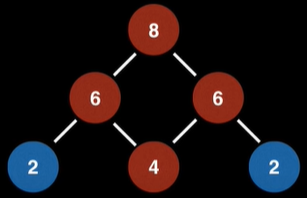

from https://www.youtube.com/watch?v=wptevk0bshY&list=PLLXdhg_r2hKA7DPDsunoDZ-Z769jWn4R8&index=6

outline

    1. Discussin & Examples

        1.1 What is a PQ?
        1.2 What is a heap?
        1.3 When and where is a PQ used?
        1.4 How to turn a Min PQ into a Max PQ
        1.5 Complexity Analysis

    2. Binary heap PQ Implementation Details

        2.1 Heap  singking and swimming (also called sift up&down or bubble up&down)
        2.2 Adding elements to PQ
        2.3 Removing(polling) elements from PQ

# Priority Queue

## 1.1 what is a PQ?

Abstract Data Type(ADT) that operates similar to a normal queue except that **each element has a certain priority**.
priority of the elements determine the order in which elements are removed from the PQ.

note)
priority queues only supports comparable data.
the data inserted into the priority queue must be able to be ordered in some way either from least to greatest or greatest to least.

ex)

1,3,4,8,14,22

Instructions:
poll() remove 1
add(2) add 2
poll() remove 2
add(4) add 4
poll() remove 3
add(5)
add(9)
poll rest continously poll until PQ is empty

removed by poll() << heap을 사용해 우선순위에 따라 element를 제거.
1 2 3 4 4 5 8 9 14 22

## 1.2 What is a heap?

- a **tree** based DS that satisfies the **heap invariant** ( also called heap property) : The least (highest priority) element of any subtree is at the root of that subtree.
- binary tree is complete(no holes)
- max heap : root가 최대값
- min heap : root가 최솟값
- PQ를 위해 사용됨, PQ는 떄떄로 heap이라고 불리기도 함.

```
if FIFO{
  Queue
    [array]
    [linked list]

  if Proiroty is needed{
    Priority Queue
      [heap]
    }
}
```

linked list 구조를 사용하는 일반적인 queue는 enque시, 입력을 받는 순서 그대로 노드를 연결해 FIFO의 입출력 방식이 되지만, priority queue와 같이 입력 순서에 관계 없이, items의 우선순위에 따라 자료를 보관(enqueue)하고 사용할(dequeue) 경우, heap구조를 사용한다.

invalid


valid


satisfies the heap invariant.
Heaps like these are often seen in binomial heaps.

valid


invalid



it contains a cycle. Heaps must be trees.

valid


left : invalid right : valid


## 1.3 When and where is a PQ used?

- Dijkstra's Shortest Path algorithm
- fetch the 'next best' or 'next worst'
- Huffman coding (lossless data compression)
- BFS(best first search) algorithm
- Minimum Spaning Tree (MST) algorithm

## 1.4 Complexity PQ with binary heap

| algorithm                                     | BigO      |
| --------------------------------------------- | --------- |
| binary heap construction                      | O(n)      |
| Polling                                       | O(log(n)) |
| Peeking                                       | O(1)      |
| Adding                                        | O(log(n)) |
| Naive Removing                                | O(n)      |
| Advanced removing with help from a hash table | O(log(n)) |
| Naive contains                                | O(n)      |
| contains check with help of a hash table      | O(1)      |

- binary heap construction : unsroted 상태의 binary heap
- polling : 최악의 경우 depth만큼 swap

http://www.cs.cornell.edu/courses/cs2110/2015fa/L17-PriorityQueuesAndHeaps/cs2110PqueuesHeaps.pdf